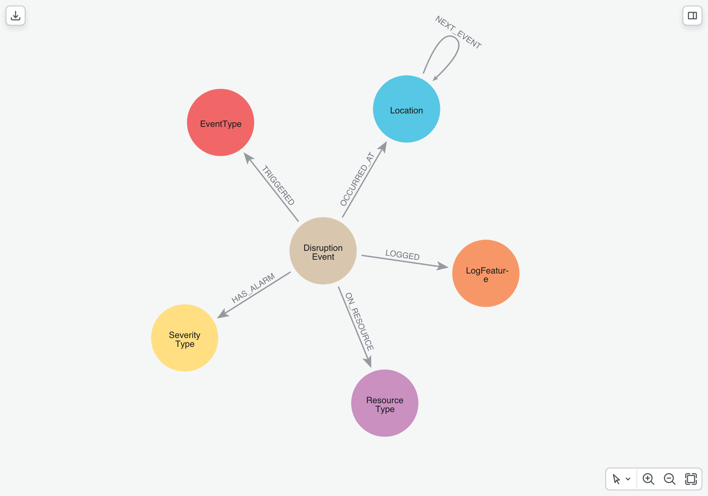
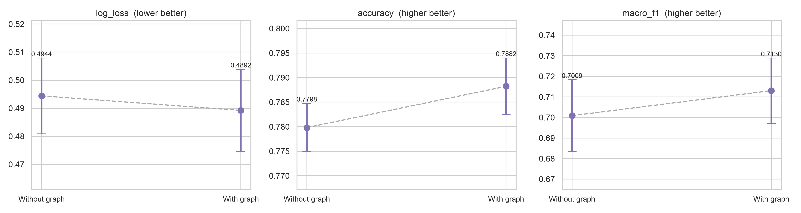
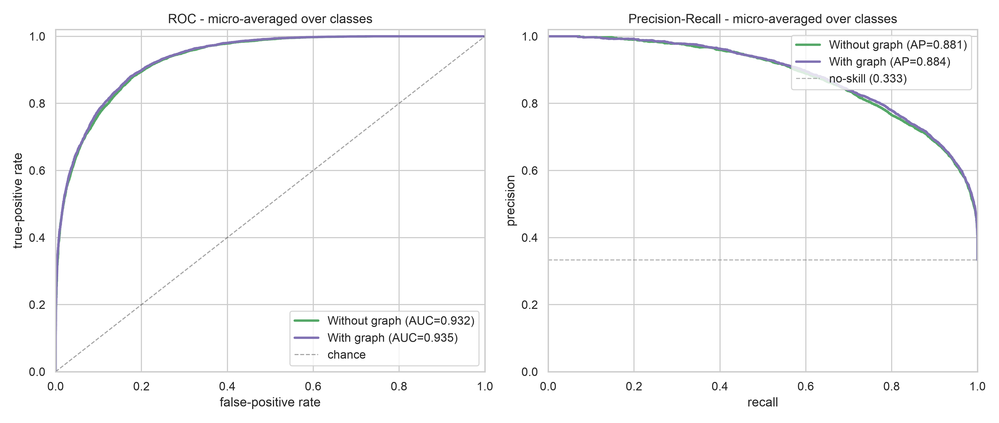

# Better Outage Prediction with Graphs in Neo4j

This project demonstrates how graph-based techniques can sharpen disruption analysis and severity prediction on a telecommunications network, using Neo4j and its Python ecosystem. It uses the [Telstra Network Disruptions](https://www.kaggle.com/c/telstra-recruiting-network) dataset, which contains real disruption events labelled with a **fault severity** (`0` none / `1` few / `2` many faults), together with the alarm each one raised and the log-features, resource types and event types it touched.

This presents typical patterns and techniques for analysing network-operations data, suitable for triaging incidents, understanding how faults relate across a network, and turning a flat incident log into a connected structure an operations team can actually reason about - the kind of telemetry collected by monitoring and ticketing systems such as [Nagios](https://www.nagios.org/), [Zabbix](https://www.zabbix.com/), [Prometheus](https://prometheus.io/) or a network OSS.

<p align="center">
  
  <br>
  <sub>The schema of the Telstra Network Disruptions dataset represented as a graph.</sub>
</p>

After reading these notebooks, you will conclude that **outage triage is a graph problem**. The relationships between events, locations, alarms and log-features form a rich, interconnected structure, and we show that mining it with Neo4j adds a new, **orthogonal** signal that improves a strong conventional severity model - even after that model already exploits the dataset's single best feature. Crucially, Neo4j also lets us prove *which* structure pays: a graph that links events by the **symptoms they share** lifts every metric, and the same A/B harness cleanly retires a second graph that only restated existing information. That ability to build, query and rigorously compare graph structures - then keep only the signal that's real - is exactly what makes Neo4j the right tool for this problem.

## Key objectives

These notebooks demonstrate, end to end, where the predictive signal in a disruption dataset really lives and what Neo4j brings to it that a flat table of incidents cannot. Concretely, they show how to:

- **Model network disruptions as a graph.** Reshape the raw, one-row-per-attribute Telstra tables into a connected `(:DisruptionEvent)-[:OCCURRED_AT]->(:Location)` schema, so that how an event relates to its location, alarm, log-features and resources becomes a first-class, queryable structure rather than columns in a row.
- **Explore where the signal lives with Cypher.** Drive analysis directly from queries against the graph, so what you see reflects how the business actually relates these entities.
- **Capture how faults cascade between sites** with a `(:Location)-[:NEXT_EVENT {weight}]->(:Location)` edge, and **link events by their symptom fingerprint** with graph similarity (`nodeSimilarity`) over shared log-features.
- **Use the graph as a feature store for ML.** Compute graph-derived features and show, in a controlled A/B test with an identical learner and identical splits, exactly how much they move the needle over per-event statistics alone.
- **Prove the graph earns its keep.** Run a leakage-free repeated holdout that separates a real, consistent improvement from noise - confirming the symptom-similarity graph delivers a genuine lift, and using the very same rigour to retire a second graph that didn't.

## Using this notebook

Start by creating a `.env` file in the root of this project with the following content, replacing the placeholders with your actual Neo4j connection details:

```env
NEO4J_URI=bolt://localhost:7687
NEO4J_USERNAME=neo4j
NEO4J_PASSWORD=your_password
NEO4J_DATABASE=neo4j
DATA_DIR=.data
RENDERINGS_DIR=renderings
KAGGLE_API_TOKEN=your_kaggle_token
```

The loader downloads the [Telstra Network Disruptions](https://www.kaggle.com/c/telstra-recruiting-network) dataset straight from Kaggle (this needs valid Kaggle API credentials); once the files are present in `.data/` the download can be skipped on re-runs.

Configure your Python environment with the required dependencies (`conda env create -f environment.yml`, then `conda activate telco-network-outages`), and then run [`loader.ipynb`](./loader.ipynb) to ingest the dataset into Neo4j. The loader is **idempotent** - it wipes any previous load, recreates the uniqueness constraints, and streams everything in batches - so running it top to bottom always produces the same clean graph. After the data is loaded, the notebooks are designed to be read in the following order:

1. [`loader.ipynb`](./loader.ipynb) - ingests the raw Telstra tables and builds the connected graph in Neo4j.
2. [`analysis.ipynb`](./analysis.ipynb) - exploratory data analysis and graph visualisations, working through nine questions an operations team would actually ask: how big and connected the data is, what we're predicting, whether the alarm level alone is enough, which locations and log-features carry the risk, how events cluster, and whether the fault cascade between sites carries any signal.
3. [`predictor.ipynb`](./predictor.ipynb) - a supervised severity model, built twice (with and without graph features) to measure whether the graph improves prediction over a strong conventional baseline.

## Results: the graph is where the new signal comes from

[`analysis.ipynb`](./analysis.ipynb) establishes where the predictive signal lives - the outcome is heavily imbalanced (about two-thirds of events report no fault), the alarm level alone is not decisive, and the richest signal sits in the **log-feature codes** that many events share. [`predictor.ipynb`](./predictor.ipynb) then isolates a single question: **do graph-derived features improve a supervised severity model, or are the per-event signals enough on their own?**

It trains the *same* XGBoost configuration twice, on the *same* five 80/20 holdout splits of the labelled events, changing only the feature set:

- **Without graph:** a strong baseline - each event's own attributes (alarm level, log-feature volumes, resource and event types) plus engineered features. The single most powerful of these isn't a measurement at all, it's **timing**: where an event falls in its location's fault history.
- **With graph:** the *identical* model **plus** graph-derived features - how a location sits in the network-wide flow of faults (`(:Location)-[:NEXT_EVENT]->(:Location)`), and a vote of severities from events with a similar **symptom fingerprint** (`nodeSimilarity` over shared log-features, **146,352** similarity edges across the events).

Because the original competition never released the test answers, we evaluate on a **repeated holdout** - five fresh splits, averaged, with the spread reported - and rebuild every outcome-based feature from each split's training portion only, so the model is never scored on data it has effectively seen.

Adding the graph features moves every metric in the right direction:

| Model | Features | Log loss ↓ | Accuracy | Macro-F1 |
|-------|:--------:|:----------:|:--------:|:--------:|
| Without graph | 408 | 0.4944 | 0.7798 | 0.7009 |
| **With graph** | 412 | **0.4892** | **0.7882** | **0.7130** |

<p align="center">
  
  <br>
  <sub>Adding the symptom-similarity graph features lowers log loss and lifts accuracy and macro-F1, consistently across all five holdouts.</sub>
</p>

The headline log-loss improvement is **~1.05%**, comfortably larger than the spread across the five splits - a real, repeatable gain on top of an already-strong model, not noise. It also lands where it counts most: the improvement is concentrated on the harder "few" and "many" fault classes - exactly the minority classes the imbalanced baseline finds hardest, as the ROC and precision-recall curves show.

<p align="center">
  
  <br>
  <sub>ROC (left) and Precision-Recall (right) curves on the held-out splits, for the with- and without-graph models.</sub>
</p>

**The gain comes from genuinely new graph signal - and we can prove it.** The **symptom-similarity** graph is the source of the lift: linking events by the set of log-features they trigger, and letting each event borrow the typical severity of its look-alikes, captures *what an event looks like* - information none of the conventional features express. The same A/B rigour that confirms this gain also shows the discipline behind it: a second graph (the location **cascade**) was tested and retired because it merely restated how busy a location is. Neo4j made it cheap to try both and keep only the one that's real. And the lift isn't leakage - the similarity edges use only *which* log-features fired (never the outcome), and the severity vote is rebuilt inside each split from training data alone.

### Why a small lift matters at telco scale

A ~1% improvement in log loss sounds modest in isolation - but operationally, the context is everything. A national carrier processes **tens of thousands of disruption events** a day, and the model's job is triage: deciding which incidents get an engineer dispatched, which get watched, and which are safely ignored. At that volume, a small per-event gain compounds into a large daily difference in how field resources are allocated.

Three things make this lift more valuable than the headline number suggests:

- **It lands on the expensive classes.** The improvement is concentrated on the minority "few" and "many" fault classes - the events that actually become outages. Catching even a few more of these earlier means faster dispatch, shorter mean-time-to-repair, and fewer breached SLAs - precisely the events where a missed call is most costly.
- **It's better-calibrated confidence, not just more correct guesses.** Log loss rewards *well-calibrated* probabilities, so the graph makes the model more trustworthy about *how sure* it is. For triage, a reliable confidence score is what lets an operations team set a defensible threshold and automate the easy decisions.
- **It's a free-riding signal.** The graph feature is cheap to compute and drops into the existing pipeline without new data collection - the log-features it relies on are already captured for every event.

In a domain where outages carry regulatory, financial and reputational weight, a repeatable edge that sharpens detection of the worst faults - at no additional data cost - is well worth the modest engineering of a graph projection.

### Bottom line

The common thread is that **modelling disruptions as a graph in Neo4j adds a dimension the flat incident table cannot capture: what an event *looks like* relative to every other event.** Even after the conventional model exploits the dataset's single strongest feature (where an event sits in its location's fault history), the symptom-similarity graph still finds a genuinely **orthogonal** signal that lifts every metric - and lifts it on precisely the minority "few" / "many" classes an operations team cares about most. That is how triage goes from *good* to **great**: a new signal that is cheap to compute in Neo4j and drops straight into an existing ML pipeline.

And because the graph lives in Neo4j, the same platform that *adds* the signal is the one that lets you *trust* it. The A/B harness that confirmed the symptom-similarity lift also let us test and retire a second graph that didn't pay - so what ships is only the structure that's provably real. **Neo4j is not just a query engine here - the graph itself is where the most predictive new signal comes from, and Neo4j is what makes that signal both discoverable and dependable.**

## Proposed Agentic Flows

Several specialized agentic flows can be integrated into the network outage prediction pipeline to automate key tasks. For instance, an incident cascade analysis flow can monitor new disruption events at specific locations, traverse the historical NEXT_EVENT network topology to estimate downstream propagation probabilities, and trigger proactive alerts to operations teams when cascade risks exceed a set threshold.

Another flow can manage the machine learning validation harness, ensuring that any newly engineered graph feature is computed in a leakage-free manner strictly within training splits during repeated holdouts. Additionally, a symptom-similarity evolution flow can continuously monitor the performance of the similarity graph, dynamically adjusting nodeSimilarity thresholds or recalculating shared log-feature weights as telemetry patterns shift.

Finally, a real-time ingestion alignment flow can consume raw logs from monitoring tools, map them to the (:DisruptionEvent) graph schema, and alert developers if new log-features or resource types emerge that require updating the model features.
